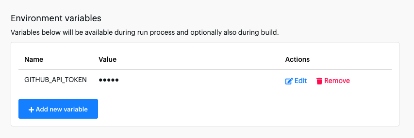
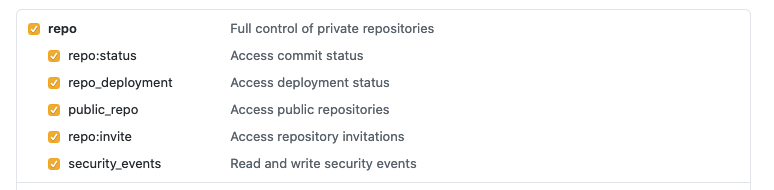

# GitHub Champion

Metrics aren't fun. What if they could be?

Celebrate your organization's unsung heroes, identify the quiet contributors who make a difference, and see who will dethrone the reigning champion.

Find out each of your repositories' top 3 contributors for your chosen time period, measured by number of issues closed, number of PR reviews, and number of PRs opened. In addition, the actor also gathers metrics like additions, deletions, and commits for everyone who contributed to the repo, if you're into more details.

Use Apify [schedules](https://docs.apify.com/schedules) to synchronize these reports with your company's sprints. Combine it with [webhooks](https://docs.apify.com/webhooks) and have the results sent to you right after they are gathered.

Who is your organization's GitHub Champion?

## How to use

To use this actor with private repositories, you will need a GitHub API token with the **repo** permission granted  - find it at <https://github.com/settings/tokens/new> and save it as an **environment variable** named `GITHUB_API_TOKEN`.



If you keep getting a `Not Found` error, it's probably to do with your authentication token. Make sure the entire `repo` permission is selected.



By default, PRs agains the `master` branch are not counted to avoid counting releases. If your repository doesn't have a `develop` branch, enable this option.

You will also need to make sure issues are **assigned** correctly (it's good practice anyway :)). One of the main metrics for the actor is the **number of issues closed** by each contributor.

## How it works

The actor makes a few requests to GitHub's API to get your repositories' stats. It then crunches the data for each repo and each contributor, discards the empty entries, and returns the goods.

**Pull request reviews** and **closed issues** count for 1 point, **created pull requests** count for half a point. The score is added, and the person with the highest score wins!

## What it doesn't do

This actor **doesn't include the number of additions, deletions, and commits** in its calculation. Some of us commit everything, others like to bundle it all into one. Some of us do package updates, which amount to thousands of added and deleted lines.

## Input

## Output

The top 3 contributors from each repository are added to the `top-contributors.json` file in the `top-threes` [key-value store](https://docs.apify.com/storage/key-value-store).

Sample top 3 array:

```json
[
  {
    "apify-web": [
      {
        "name": "fnesveda",
        "total": 27,
        "pullReviews": 11,
        "issuesClosed": 12,
        "pullsCreated": 8
      },
      {
        "name": "m-murasovs",
        "total": 18.5,
        "pullReviews": 12,
        "issuesClosed": 6,
        "pullsCreated": 1
      },
      {
        "name": "nguyeda1",
        "total": 10,
        "pullReviews": 10,
        "issuesClosed": 0,
        "pullsCreated": 0
      }
    ]
  },
  {
    "apify-core": [
      {
        "name": "Strajk",
        "total": 14.5,
        "pullReviews": 10,
        "issuesClosed": 0,
        "pullsCreated": 9
      },
      {
        "name": "gippy",
        "total": 13,
        "pullReviews": 4,
        "issuesClosed": 7,
        "pullsCreated": 4
      },
      {
        "name": "valekjo",
        "total": 6.5,
        "pullReviews": 6,
        "issuesClosed": 0,
        "pullsCreated": 1
      }
    ]
  }
]
```

More detailed breakdowns of each repository are available in the `detailed-repo-metrics` key-value-store.

Sample detailed breakdown:

```json
[
  {
    "id": "nguyeda1",
    "additions": 0,
    "deletions": 0,
    "commits": 0,
    "pullsCreated": 0,
    "pullReviews": 10,
    "issuesClosed": 0
  },
  {
    "id": "jancurn",
    "additions": 4,
    "deletions": 2,
    "commits": 1,
    "pullsCreated": 1,
    "pullReviews": 1,
    "issuesClosed": 0
  },
  {
    "id": "drobnikj",
    "additions": 0,
    "deletions": 0,
    "commits": 0,
    "pullsCreated": 0,
    "pullReviews": 6,
    "issuesClosed": 0
  },
  {
    "id": "m-murasovs",
    "additions": 123,
    "deletions": 54,
    "commits": 2,
    "pullsCreated": 1,
    "pullReviews": 12,
    "issuesClosed": 6
  },
  {
    "id": "mtrunkat",
    "additions": 0,
    "deletions": 0,
    "commits": 0,
    "pullsCreated": 0,
    "pullReviews": 5,
    "issuesClosed": 1
  },
  {
    "id": "fnesveda",
    "additions": 15652,
    "deletions": 16589,
    "commits": 13,
    "pullsCreated": 8,
    "pullReviews": 11,
    "issuesClosed": 12
  },
  {
    "id": "dragonraid",
    "additions": 17,
    "deletions": 4,
    "commits": 1,
    "pullsCreated": 1,
    "pullReviews": 0,
    "issuesClosed": 0
  }
]
```
